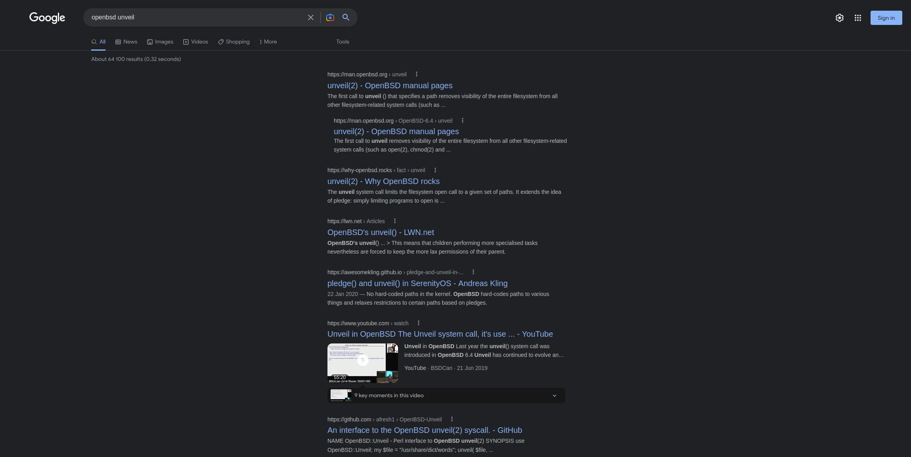
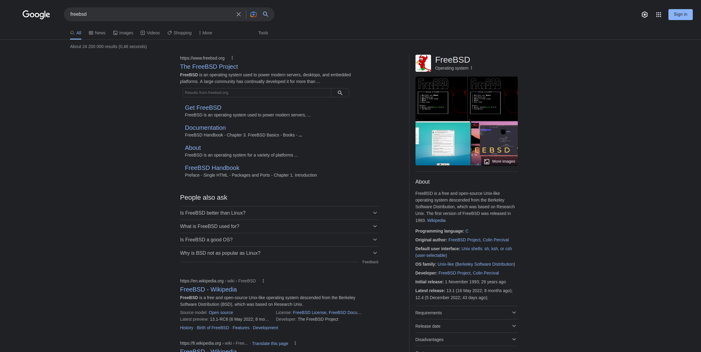
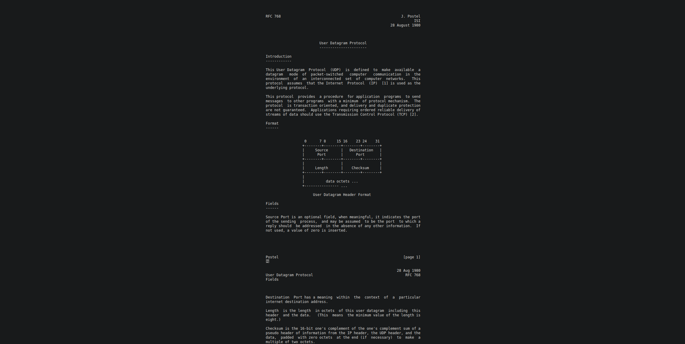

# fox-in-the-middle

**Firefox extension which center the content of the frequently used web pages.**

# Installation

* ```git clone https://github.com/agiUnderground/fox-in-the-middle.git```
* In Firefox:
    - Open the `about:debugging` page
    - click the `This Firefox` option
    - click the `Load Temporary Add-on` button
    - then select `manifest.json` in the `fox-in-the-middle` extension directory


## Problem it solves


## Currently supported websites
* google.com
* ietf.org
* rfc-editor.org/rfc/

## Demo






